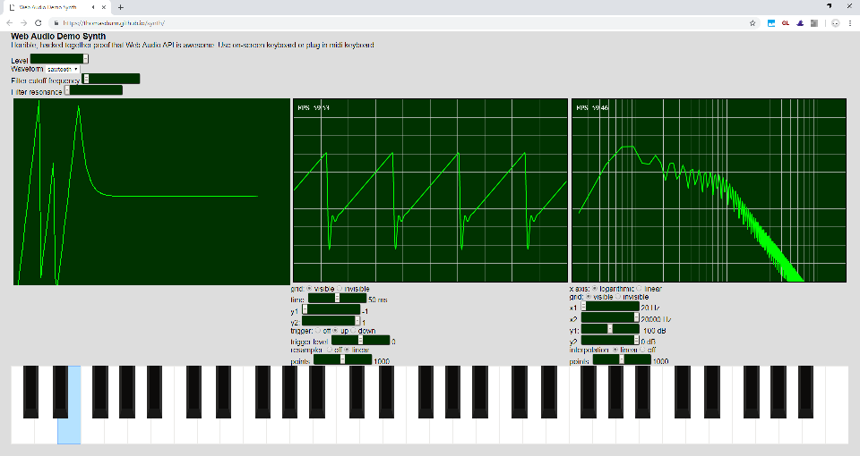

Web Audio API Demo Synth
========================

A completely hacked together experiment - Web Audio synth with:

* Controls: volume, waveform, and filter cutoff/resonance
* Envelope visualization
* Oscilloscope and Spectrum Analyzer thanks to https://github.com/sdangelo/canvasPlot.js
* On-screen touch keyboard
* Supports connecting a MIDI keyboard

Demo: https://thomasdunn.github.io/synth/

